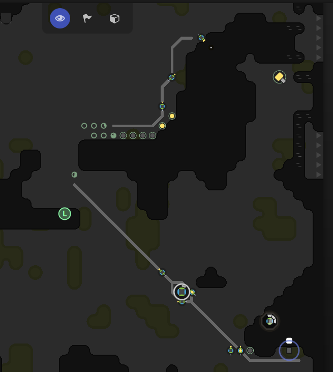

# Screeps

The world's first MMO sandbox game for programmers

## What is Screeps?

Screeps means “scripting creeps.” It’s an open-source sandbox MMO RTS game for programmers,
wherein the core mechanic is programming your units’ AI. You control your colony by writing
JavaScript which operate 24/7 in the single persistent real-time world filled by other players
on par with you.



## Modules

1. Main
    - Game main loop
1. Defense
    - Controls defense units.
1. Memory
    - Garbage Collector
1. Scheduler
    - Schedules tasks for creeps based on their roles.
1. Settings
    - Game settings
1. Spawner
    - Spawns new creeps based on the settings.
1. Prototypes
    - Prototypes game objects.

## Roles

1. Container Miner
    - Mines the energy from the sources and put them into a container.
1. Harvester
    - Collects the energy and fills it into the spawn and extractors. 
1. MacGyver
    - Builds new structures.
1. Mechanic
    - Repairs the structures.
1. Trump
    - His duty is to build up a wall, to keep invaders out of the room.
1. Upgrader
    - Upgrades the room controller, to level up the RCL (Room Control Level) and unlock new buildings.

## Deployment

1. Install Dependencies with `npm install`.

1. Create a `.screeps.json` file with the following content:

    ```
    {
      "email": "foo@bar.com",
      "password": "SecretPassword",
      "branch": "default",
      "ptr": false
    }
    ```

1. Then run `grunt screeps`.

## Ideas/Improvements

- Create a scheduler for energy harvesting, sometimes the creeps get to the container which is empty yet.
- More complex spawn system than just a priority list.
- Expand harvesting to neighbor rooms.
- Make more use of the memory to save cpu power.
